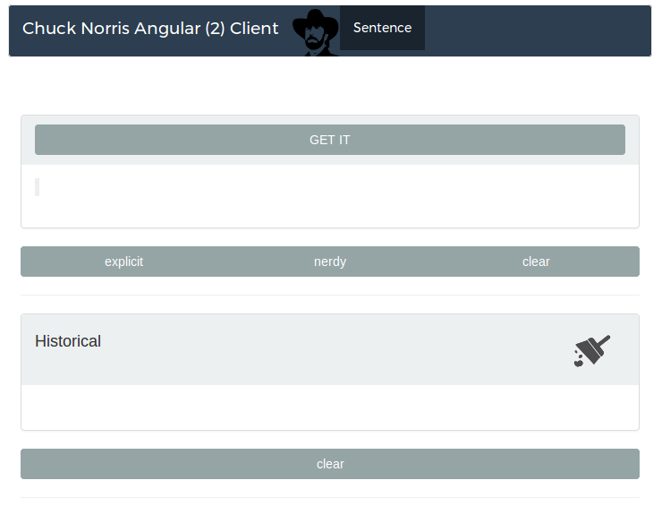
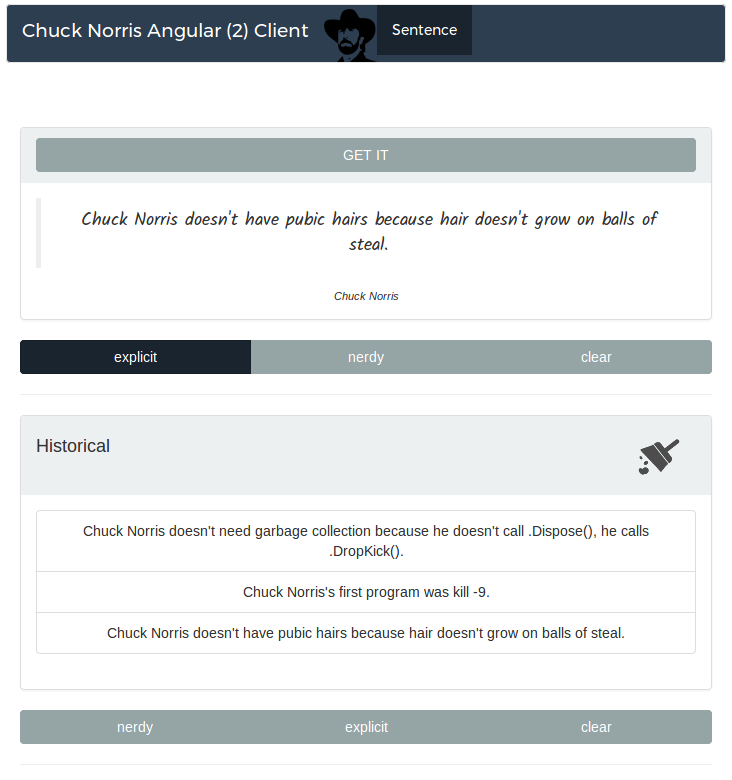

# ChuckNorrisAngular2Client

This project was generated with [angular-cli](https://github.com/angular/angular-cli) version 1.0.0-beta.30.

This project is a rebuild of the [old angular-chuck client](https://github.com/adrianabreu/chuck-norris-angular-client) I made with a friend a few months ago in AngularJs.

# Try live! 

[http://adrianabreu.com/chuck-norris-angular2-client](http://adrianabreu.com/chuck-norris-angular2-client)

# Screenshots

